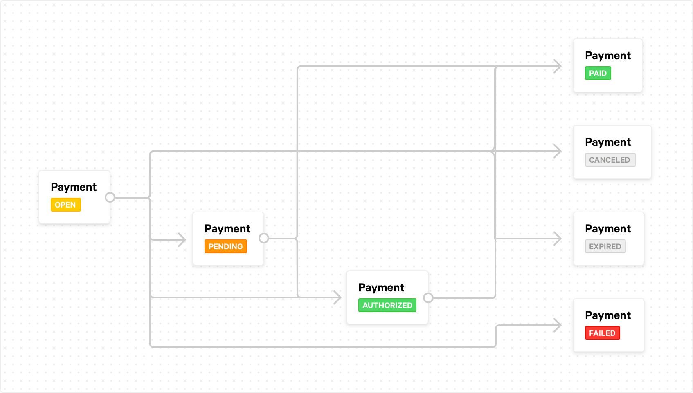

> Reference: https://docs.mollie.com/payments/accepting-payments

# Features
## 1. Aceitando pagamentos
## 2. Checkout hospedado
## 3. Mudanças de Status

### Desenho do fluxo de pagamento

- `OPEN`
  O pagamento foi criado, mas nada mais aconteceu ainda

- `CANCELED`
  Seu cliente cancelou o pagamento. Este é um estatuto definitivo.

- `PENDING`
  Este é um status temporário que pode ocorrer quando o processo de
  pagamento real foi iniciado, mas ainda não está concluído.
  Nada realmente precisa acontecer do seu lado quando esse status ocorre.

- `AUTHORIZED`
  Se o meio de pagamento suportar capturas, o meio de pagamento terá
  e status enquanto novas capturas puderem ser criadas.

- `EXPIRED`
  O pagamento expirou, por exemplo, seu cliente abandonou o pagamento.

- `FAILED`
  O pagamento falhou e não pode ser concluído com um método de pagamento
  diferente. Chamaremos seu webhook quando um pagamento passar para o failedstatus.

- `PAID`
  Este status ocorre sempre que um pagamento é efetuado com sucesso.

### Quando um pagamento expira?
Quando o seu cliente não efetua um pagamento real, o pagamento expirará em algum momento. Após um determinado prazo de
validade, o openpagamento se tornará expired. Isso pode acontecer quando um cliente decide não efetuar um pagamento e o
abandona. O prazo de validade é diferente para cada método de pagamento:

#### Prazos de validade por forma de pagamento
| Métodos de Pagamento                | Prazo de validade  |
|------------------------|--------------|
| PayPal                 | 72 horas     |
| Cartão de crédito      | 30 minutos |
| Transferência bancária | 	12(+2) dias |

> Observação

Não é uma boa ideia prever o vencimento do pagamento. É melhor esperar até que seu webhook seja chamado e buscar o status
normalmente. Esta é a forma mais confiável de manter seu sistema sincronizado com o Mollie, também no caso de pagamentos vencidos.

## 4. Reembolsos
## 5. Pagamento Recorrente
## 6. Multi Moeda
## 7. Códigos QR
## 8. Integrando Cartões Presente
